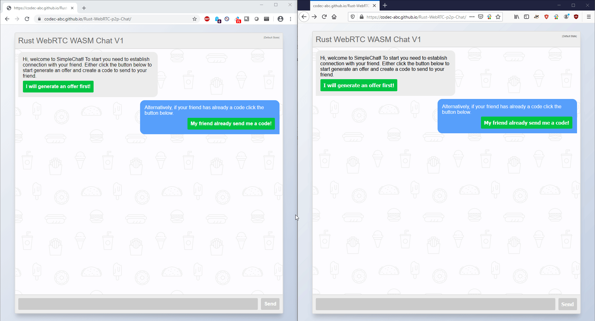

# A WebRTC Chat with Yew

## About

This is a Web-RTC chat app created in Rust.
I wanted to see and learn WASM.



## Build and Run

To build this project you need to:

1. Add `wasm32-unknown-unknown` as a target

    ```bash
    rustup target add wasm32-unknown-unknown
    ```

2. Install wasm-pack ``cargo install wasm-pack``

> This needs perl
> on Windows

```bash
choco install StrawberryPerl
```

3. Install http-server ``npm install --global http-server``

4. Build the project

    ```bash
    wasm-pack build --target web --no-typescript --out-dir ./static/pkg
    ```

5. Run by

```bash
cd static
http-server -p 8080
```

> npm is used to get the http-server


## Special thanks

* [Sajad Hashemian](https://github.com/sajadhsm?tab=repositories) for making this [nice HTML chat](https://codepen.io/sajadhsm/pen/odaBdd)
